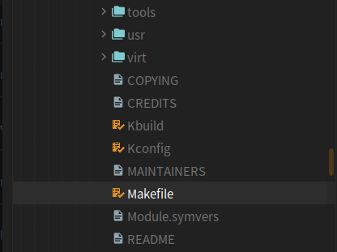
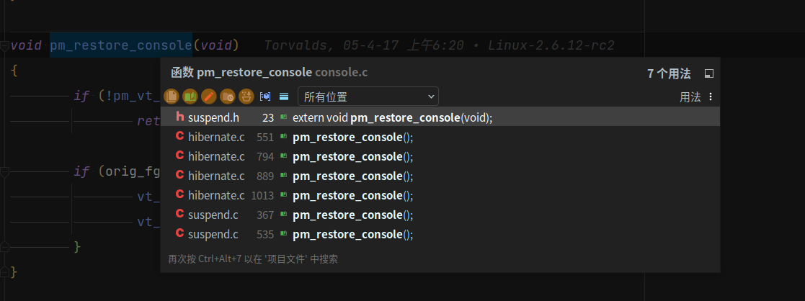
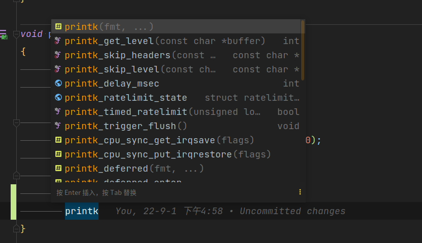

# 使用clion阅读编辑linux源码

[主仓库：https://github.com/buyuer/learnlinux](https://github.com/buyuer/learnlinux)

阅读linux源码有很多方式，最简单的就是使用[bootlin](https://elixir.bootlin.com/linux/latest/source)，在线阅读，不用安装任何环境，但是当进行符号跳转或搜索的话，就不是很方便了，其次无法编辑。再就是用vscode，直接打开linux源码的目录，但是由于vscode无法直接解析构建系统的信息，对于跳转和代码补全就不是很方便。

clion作为c/c++ IDE的后起之秀，继承了大量IDEA的优点，看源码无论是符号跳转还是代码补全，都非常智能和方便。linux使用makefile+kconfig的方式描述构建规则，老版本的clion并不支持makefile的工程，只支持cmake工程，这样打开linux源码的目录，无法创建clion的工程，也就无法建立索引，那么代码补全和符号调整都无法工作。只能通过bear工具，跟踪编译过程，再通过kernel-grok生成CMakeLists.txt，再用clion打开。但是新版本的clion（2020.2起），正式加入了Makefile工程的支持，也就是说，clion可以直接解析make的构建过程。clion是通过 `--just-print`参数，使make只打印命令，并不进行真正的调用，进而分析make的命令输出，来解析工程的构建描述。具体可参考clion的官网介绍：[jetbrains官方介绍](https://www.jetbrains.com.cn/help/clion/makefiles-support.html)

首先配置linux内核源码

```shell
make ARCH=x86_64 defconfig
```

源码已经配置完毕，make已经准备就绪，现在直接执行make就可以进行编译了。这时，打开clion，直接打开源码目录下的Makefile文件。



选择作为项目打开


进入clion之后，会提示创建清理目标，选择确定


此时，clion就会开始执行 `make --just-print`，并分析make的输出，由此建立工程索引，分析工程要花费很长时间，而且会产生大量index缓存文件（大约几个G）。在打开linux源码之前，需要将clion的最大堆内存改到4GB或以上，否则建立索引的时候，可能会卡住。后面如果修改了源码的配置，可以点击

> 工具->Makefile->清理并重新加载Makefile项目

这样就会重新执行 `make --just-print`，重新分析工程，并重建索引。

索引建立好后，符号跳转和代码补全提示，都可以正常工作。




