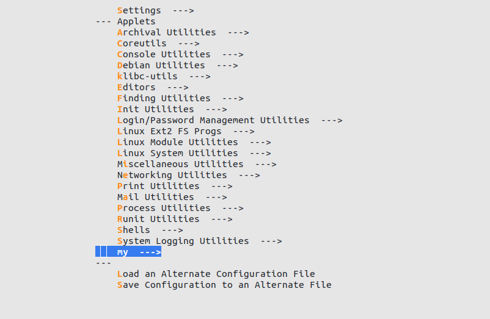
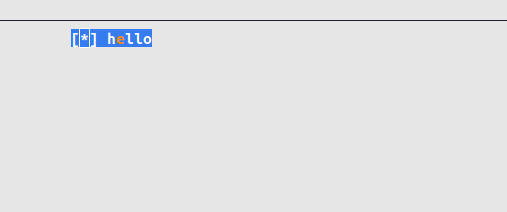

# 在busybox中添加applet

[主仓库：https://github.com/buyuer/learnlinux](https://github.com/buyuer/learnlinux)

在[搭建最小的linux系统](./搭建最小的linux系统.md)一文中，我们成功搭建了一个非常简单但是可以运行的操作系统，我们使用busybox构建了基础的文件系统，其中包含了busybox提供的一些基本命令，如ls、cd、sh等，在busybox中，这些命令程序成为applet。那么如何在我们自己的系统里运行我们自己命令程序？本文将在busybox添加我们自己编写的hello applet。

## 1、创建目录和源文件

进入到busybox的根目录，创建my目录

```shell
mkdir my
```

在my目录下创建hello.c

```shell
touch hello.c
```

将如下代码键入到helloc.c中

```c
#include "busybox.h"

int hello_main(int argc, char *argv[])MAIN_EXTERNALLY_VISIBLE;

int hello_main(int argc, char *argv[]) {
    printf("hello\n");

    for (int index = 0; index < argc; ++index) {
        printf("argv[%d]: %s\n", index, argv[index]);
    }

    return 0;
}

```

这个源文件很简单，入口是hello_main函数，里面调用了标准库的printf。但是这个源文件还没法编译到busybox里，因为还没有添加到构建系统里

## 2、添加kconfig选项

busybox的构建系统主要由两部分组成，一部分是基于kconfig的配置系统，一部分是基于makefile的编译系统。kconfig中定义了各种配置选项，并提供和用户交互的界面。最后由kconfig生成配置文件和头文件，makefile根据配置文件进行编译，源文件根据头文件中宏进行预处理，这样就构成了一套可裁剪可配置的构建系统。关于kconfig和相关构建原理，在后面的文章里会介绍。

在my目录下创建用于kconfig的配置文件

```shell
touch Config.src
```

并在文件键入如下代码

（注意endmenu后要空一行）

```
menu "my"

config HELLO
	bool "hello"
	default y
	help
		one demo app

INSERT

endmenu

```

在busybox跟目录下的Config.in文件的最后加入

```
source my/Config.in
```

在busybox根目录下执行

```shell
make menuconfig
```

可以看到已经有了添加进去的配置



hello选项默认为打开



## 3、添加makefile编译支持

有了kconfig选项还需要添加makefile的相关文件和修改，才能将hello.c编译进busybox。

在my目录下创建Kbuild.src文件，并键入如下代码

```makefile
lib-y :=

lib-$(CONFIG_HELLO) += hello.o

INSERT

```

对根目录下的Makefile文件做如下修改

（这样Makefile就会处理my目录里的文件）

```
diff --git a/Makefile b/Makefile
index edaa3c148..dcc2fd990 100644
--- a/Makefile
+++ b/Makefile
@@ -492,6 +492,7 @@ libs-y              := \
                sysklogd/ \
                util-linux/ \
                util-linux/volume_id/ \
+               my/ \
 
 endif # KBUILD_EXTMOD
 
```

在include/applets.src.h中找到INSERT，并在INSERT上面键入

```c
IF_HELLO(APPLET(hello, BB_DIR_USR_BIN, BB_SUID_DROP))
```

在include/usage.src.h中找到INSERT，并在INSERT上面键入

```c
#define hello_trivial_usage "hello"
#define hello_full_usage    "one demo applet and print hello"
```

## 4、运行hello

一切准备就绪，在跟目录下执行

```shell
make -j
```

编译完成后，把rootfs.img挂载，并重新安装busybox。重新启动qemu，在终端里键入hello测试效果。


PS：修改后的busybox已经push到github上我自己fork的仓库里了，分支为my

[仓库链接：https://github.com/buyuer/busybox.git](https://github.com/buyuer/busybox.git)

clone好后，切换到my分支

```shell
git switch my
```
