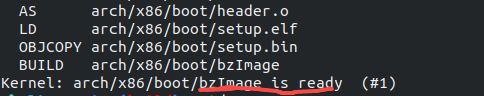

# 最小Linux系统搭建

[主仓库：https://github.com/buyuer/learnlinux](https://github.com/buyuer/learnlinux)


一个操作系统宏观上分为两个部分，kernel和shell（核和壳），kernel就是操作系统内核，shell在kernel之上，提供用户界面。只有kernel，不能算作一个操作系统，因为什么也做不了。本文通过linux内核和busybox工具集，制作一个最简单的linux系统。

系统环境为ubuntu-22.04

## 1、安装必要的软件包

更新本地仓库

```shell
sudo apt update
sudo apt upgrade
```

然后安装必要的软件包

```shell
sudo apt install build-essential git kconfig-frontends flex bison libelf-dev bc libssl-dev qemu qemu-system-x86
```

## 2、创建工作目录

进入到用户目录下

```shell
cd ~
```

创建work目录

```shell
mkdir work
```

进入到work目录下

```shell
cd work
```

后面大部分的操作都将在这个目录下进行，当然work目录创建在非用户根目录下也是可以的

## 3、获取linux-kernel源码

这里介绍有两种方式获取linux源码

a、直接下载linux内核的源码，并解压，网址如下：

[The Linux Kernel Archives](https://www.kernel.org/)

b、通过git克隆整个仓库

```shell
git clone https://github.com/torvalds/linux.git
```

或者使用国内的镜像

```shell
git clone https://mirrors.tuna.tsinghua.edu.cn/git/linux.git
```

克隆好后切换到最新的stable分支

```shell
git checkout v5.19
```

## 4、编译linux内核

进入到linux源码的根目录，执行

```shell
make ARCH=x86_64 defconfig
```

这一步是生成.config配置文件，由于我的主机是x86_64的架构，所以使用x86_64的默认配置，如果是arm主机，则将x86_64替换成arm64。

接下来，执行如下命令，开始编译内核的镜像

```shell
make bzImage -j
```

编译大约需要5分钟左右的时间，具体因性能而异，如果编译成功，则会看到如下输出



bzImage就是编译出来的内核镜像文件

## 5、获取并编译busybox

a、官网直接下载：

[busybox](https://busybox.net/)

下载好后，将源码解压到work目录下

b、通过git克隆到源码到work目录下

```shell
git clone https://github.com/mirror/busybox.git
```

同样我们把busybox切换到稳定的分支上，进入busybox源码根目录

```shell
git checkout 1_35_stable
```

进入到busybox的根目录中，执行：

```shell
make menuconfig
```


按Enter进入到Settings的设置子项里，并通过方向下键选中

> [*] Build static binary (no shared libs)

选中后按y键开启这个配置


按左右方向键选中Exit，并按Enter返回到主菜单，在选中Exit，按Enter退出，并选中Yes确认保存。


接下来编译busybox

```shell
make -j
```

## 6、制作根文件系统

首先进入work目录下，生成空的镜像文件

```shell
dd if=/dev/zero of=rootfs.img bs=1M count=8
```

把刚生成的镜像文件格式化为ext4的文件系统

```shell
mkfs.ext4 rootfs.img
```

并创建一个目录用于挂载镜像文件

```shell
mkdir ./rootfs
```

挂载镜像文件

```shell
sudo mount -t ext4 -o rw rootfs.img ./rootfs
```

安装文件系统到rootfs目录下

（因为根目录下的目录默认都是root用户，所以我们需要用root权限创建，避免权限问题注意这里使用root权限问题）

```shell
sudo make -C busybox install CONFIG_PREFIX=../rootfs
```

进入到rootfs目录，并创建相关的文件夹

（注意这里使用root权限创建，原因同上）

```shell
sudo mkdir etc dev home root proc sys mnt
```

这样我们就制作好了一个非常简单的根文件系统，此时的目录结构已经和大部分linux发行版相似了

进入到work目录，并取消挂载

```shell
sudo umount rootfs
```

## 6、运行最小系统

```shell
qemu-system-x86_64 -kernel ./linux/arch/x86_64/boot/bzImage -hda ./rootfs.img -append "root=/dev/sda console=ttyS0" -nographic
```

运行之后，不出意外将会看到如下输出

> Please press Enter to activate this console.

按Enter就进入到了终端，此时我们已经成功的运行了这个最小的linux系统，键入ls查看目录结构


一个最小linux系统的搭建就此完成！！！
